# QuickAid AWS Architecture

## Overview

This document describes the AWS-native architecture for the QuickAid emergency response platform. The architecture uses AWS services exclusively for all components including network, compute, storage, notifications, and monitoring.

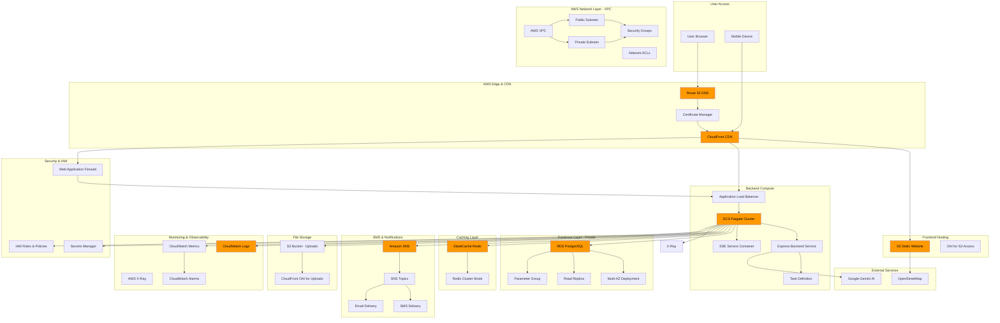

---

## Network Architecture

### VPC Design

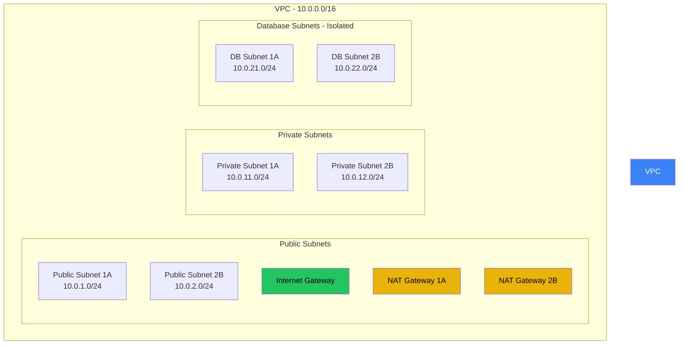

**Components Description:**

| Component | CIDR | Purpose |
|-----------|------|---------|
| VPC | 10.0.0.0/16 | Primary network isolation boundary |
| Public Subnets | 10.0.1.0/24, 10.0.2.0/24 | ALB, NAT Gateways, Bastion Host |
| Private Subnets | 10.0.11.0/24, 10.0.12.0/24 | ECS Tasks, ElastiCache |
| Database Subnets | 10.0.21.0/24, 10.0.22.0/24 | RDS PostgreSQL (no internet access) |
| Internet Gateway | - | Public internet access for public subnets |
| NAT Gateways | - | Outbound internet access for private resources |

**Security Groups:**

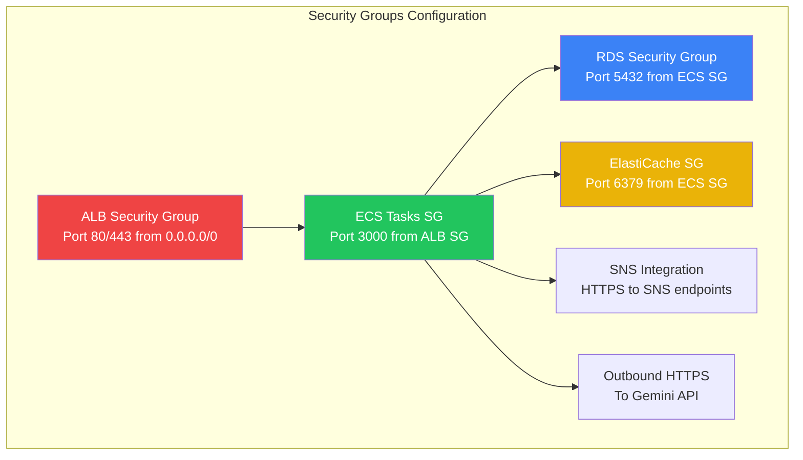

---

## Compute Architecture

### ECS Fargate Deployment

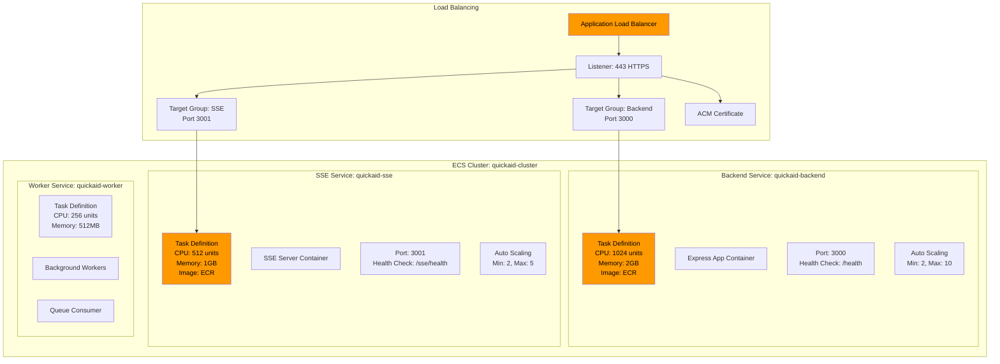

**Components Description:**

- **ECS Cluster**: Orchestration container for all services
- **Backend Service**: Express.js API server
- **SSE Service**: Dedicated service for Server-Sent Events (long-lived connections)
- **Worker Service**: Background processing for SMS queues, scheduled tasks
- **ALB**: Routes traffic to appropriate target groups based on path routing
- **Target Groups**: Group of ECS tasks for load distribution
- **Auto Scaling**: Automatically scales tasks based on CPU/memory metrics

---

## Storage Architecture

### Database Layer (RDS PostgreSQL)

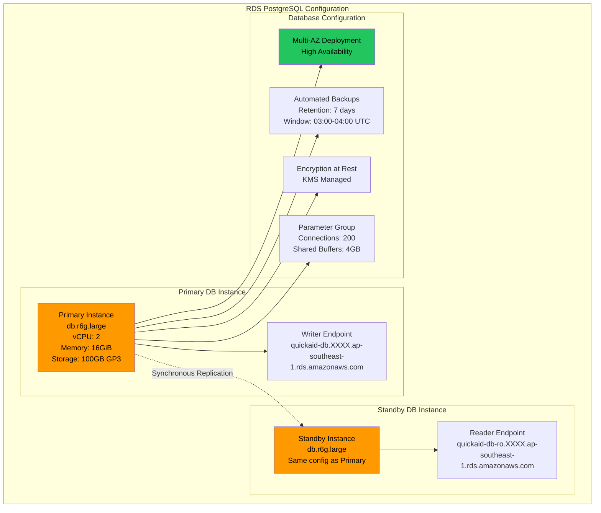

**Database Schema Tables:**

| Table | Description | Estimated Rows |
|-------|-------------|----------------|
| users | User accounts and authentication | 10,000 |
| incidents | Emergency incident reports | 100,000 |
| incidents_updates | Incident timeline entries | 500,000 |
| ai_triage_data | AI analysis results | 100,000 |
| hospitals | Hospital resource data | 500 |
| volunteers | Volunteer registrations | 5,000 |
| volunteer_tasks | Volunteer task listings | 2,000 |
| communities | Community organizations | 1,000 |
| broadcasts | Emergency broadcasts | 10,000 |
| broadcasts_audience | Broadcast recipient mapping | 1,000,000 |
| sms_logs | SMS delivery logs | 10,000,000 |

---

### Caching Layer (ElastiCache Redis)

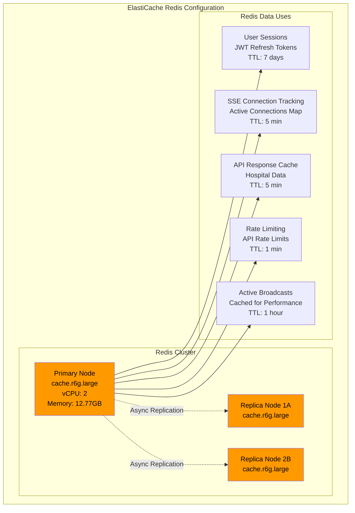

**Components Description:**

- **Primary Node**: Handles write operations
- **Replica Nodes**: Handle read operations (read-after-write consistency acceptable)
- **Session Store**: Stores JWT refresh tokens, user session data
- **SSE Connections**: Tracks active SSE connections for targeted notifications
- **API Response Cache**: Caches frequently accessed data (hospitals, volunteers)
- **Rate Limiting**: Implements sliding window rate limiting
- **Broadcast Cache**: Caches active broadcasts for quick lookup

---

### S3 Storage

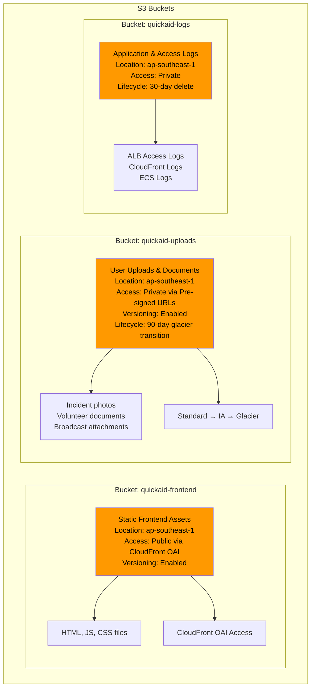

---

## SMS & Notification Architecture

### Amazon SNS Integration

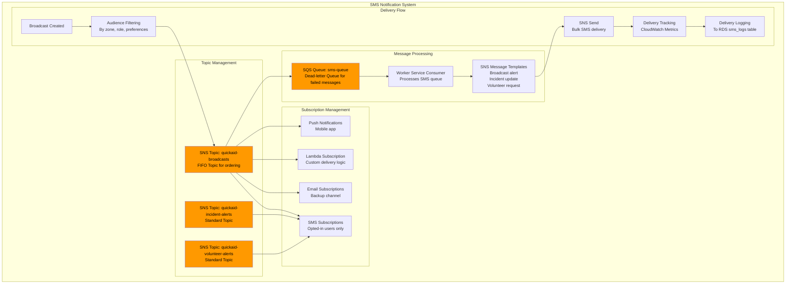

### SMS Broadcast Flow

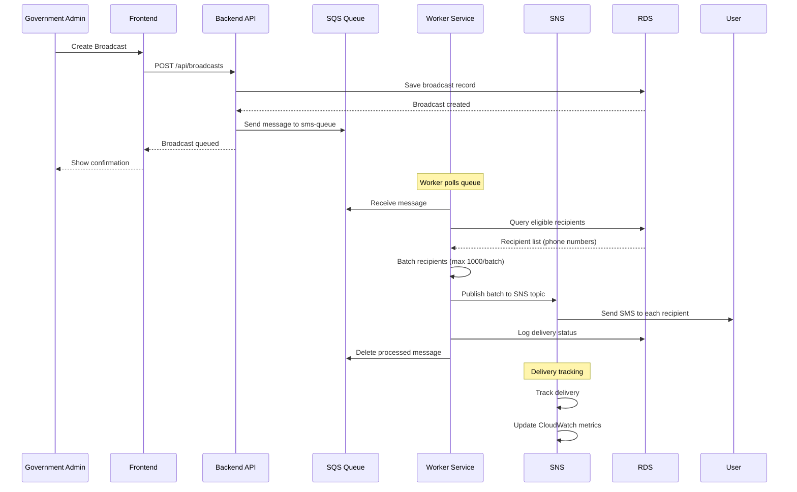

**SMS Configuration Details:**

| Setting | Value |
|---------|-------|
| Region | ap-southeast-1 (Singapore) |
| Sender ID | QUICKAID |
| Default SMS Type | Transactional |
| Delivery Status Logging | Enabled |
| Monthly Spend Limit | $1,000 (configurable) |
| Opt-out Keyword | STOP |
| Rate Limit | 5 SMS/second per account |

**SNS Topic Policy Example:**

```json
{
  "Version": "2008-10-17",
  "Id": "__default_policy_ID",
  "Statement": [
    {
      "Sid": "__default_statement_ID",
      "Effect": "Allow",
      "Principal": {
        "AWS": "arn:aws:iam::123456789012:role/quickaid-ecs-task-role"
      },
      "Action": "SNS:Publish",
      "Resource": "arn:aws:sns:ap-southeast-1:123456789012:quickaid-broadcasts"
    }
  ]
}
```

---

## Frontend Hosting Architecture

### CloudFront + S3 Deployment

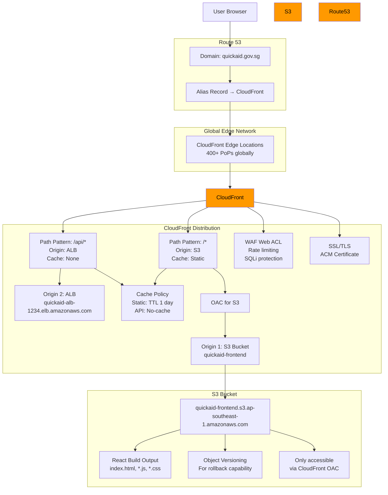

**Components Description:**

- **CloudFront**: Global CDN for low-latency content delivery
- **Route 53**: DNS management and alias records
- **S3 Bucket**: Stores static frontend assets (React build output)
- **OAC (Origin Access Control)**: Restricts S3 bucket access to CloudFront only
- **ALB Origin**: Forward API requests to backend
- **WAF**: Web Application Firewall for protection against attacks
- **SSL/TLS**: ACM-managed certificates for HTTPS
- **Cache Policies**: Optimized caching for static and dynamic content

---

## Security Architecture

### IAM & Security Layers

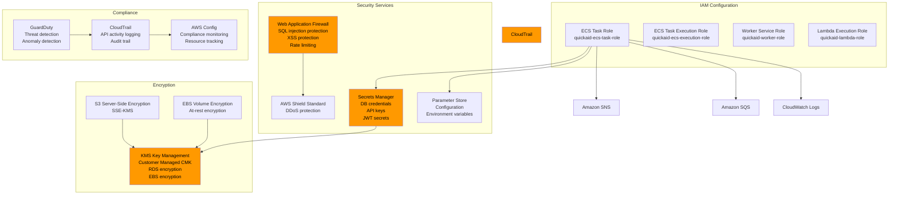

**IAM Role Policies:**

```json
// ECS Task Role Permissions
{
  "Version": "2012-10-17",
  "Statement": [
    {
      "Effect": "Allow",
      "Action": [
        "secretsmanager:GetSecretValue",
        "secretsmanager:DescribeSecret"
      ],
      "Resource": [
        "arn:aws:secretsmanager:ap-southeast-1:123456789012:secret:quickaid-db-*",
        "arn:aws:secretsmanager:ap-southeast-1:123456789012:secret:quickaid-jwt-*"
      ]
    },
    {
      "Effect": "Allow",
      "Action": [
        "ssm:GetParameter",
        "ssm:GetParameters"
      ],
      "Resource": "arn:aws:ssm:ap-southeast-1:123456789012:parameter/quickaid/*"
    },
    {
      "Effect": "Allow",
      "Action": [
        "sns:Publish",
        "sns:CreateTopic",
        "sns:Subscribe"
      ],
      "Resource": "arn:aws:sns:ap-southeast-1:123456789012:quickaid-*"
    },
    {
      "Effect": "Allow",
      "Action": [
        "sqs:SendMessage",
        "sqs:ReceiveMessage",
        "sqs:DeleteMessage",
        "sqs:GetQueueAttributes"
      ],
      "Resource": "arn:aws:sqs:ap-southeast-1:123456789012:quickaid-*"
    },
    {
      "Effect": "Allow",
      "Action": [
        "logs:CreateLogGroup",
        "logs:CreateLogStream",
        "logs:PutLogEvents"
      ],
      "Resource": "*"
    },
    {
      "Effect": "Allow",
      "Action": [
        "elasticache:Connect"
      ],
      "Resource": "arn:aws:elasticache:ap-southeast-1:123456789012:cluster:quickaid-redis"
    },
    {
      "Effect": "Allow",
      "Action": [
        "s3:PutObject",
        "s3:GetObject",
        "s3:DeleteObject"
      ],
      "Resource": "arn:aws:s3:::quickaid-uploads/*"
    }
  ]
}
```

---

## Monitoring & Observability Architecture

### CloudWatch Integration

```mermaid
graph TB
    subgraph "Logging"
        ECSLogs[ECS Task Logs<br/>/aws/ecs/quickaid-backend]
        SSELogs[SSE Service Logs<br/>/aws/ecs/quickaid-sse]
        WorkerLogs[Worker Service Logs<br/>/aws/ecs/quickaid-worker]
        ALBLogs[ALB Access Logs<br/>/aws/elasticloadbalancing/quickaid-alb]
        CFLogs[CloudFront Access Logs<br/>quickaid-cloudfront-logs]
    end

    subgraph "Metrics Collection"
        CPUMetrics[CPU Utilization<br/>ECS Tasks]
        MemMetrics[Memory Utilization<br/>ECS Tasks]
        DBMetrics[RDS Metrics<br/>Connections, Latency]
        CacheMetrics[Redis Metrics<br/>Hits, Evictions]
        APIMetrics[API Metrics<br/>Latency, Error Rate]
        SMSMetrics[SNS Metrics<br/>Delivery Rate, Bounces]
    end

    subgraph "Alarms"
        HighCPU[CPU > 80% for 5 min]
        HighMemory[Memory > 85% for 5 min]
        DBConnections[DB Connections > 180]
        APIErrors[API Error Rate > 5%]
        SMSBounce[SMS Bounce Rate > 10%]
        HealthCheck[Health Check Failed]
    end

    subgraph "Dashboards"
        MainDash[QuickAid Main Dashboard<br/>Overall health metrics]
        APIDash[API Performance Dashboard<br/>Latency, throughput, errors]
        DBDash[Database Health Dashboard<br/>Connections, queries, locks]
        SMSDash[SMS Delivery Dashboard<br/>Delivery rate, cost tracking]
    end

    subgraph "Tracing"
        XRay[AWS X-Ray<br/>Distributed tracing]
        Segments[Service Map<br/>Request flow visualization]
    end

    ECSLogs --> CloudWatchLogs[CloudWatch Logs]
    SSELogs --> CloudWatchLogs
    WorkerLogs --> CloudWatchLogs
    ALBLogs --> CloudWatchLogs
    CFLogs --> S3LogsBucket[S3: quickaid-logs]

    CPUMetrics --> CloudWatchMetrics[CloudWatch Metrics]
    MemMetrics --> CloudWatchMetrics
    DBMetrics --> CloudWatchMetrics
    CacheMetrics --> CloudWatchMetrics
    APIMetrics --> CloudWatchMetrics
    SMSMetrics --> CloudWatchMetrics

    CloudWatchMetrics --> HighCPU
    CloudWatchMetrics --> HighMemory
    CloudWatchMetrics --> DBConnections
    CloudWatchMetrics --> APIErrors
    CloudWatchMetrics --> SMSBounce

    CloudWatchMetrics --> MainDash
    CloudWatchMetrics --> APIDash
    CloudWatchMetrics --> DBDash
    CloudWatchMetrics --> SMSDash

    XRay --> Segments

    style CloudWatchLogs fill:#FF9900,color:#000
    style CloudWatchMetrics fill:#FF9900,color:#000
    style XRay fill:#FF9900,color:#000
```

**Key Metrics to Monitor:**

| Metric | Threshold | Alarm Action |
|--------|-----------|--------------|
| ECS CPU Utilization | >80% for 5 min | Scale up ECS tasks |
| ECS Memory Utilization | >85% for 5 min | Scale up ECS tasks |
| RDS Freeable Memory | <2GB | Notify DBA |
| RDS Connection Usage | >90% | Scale RDS or optimize connections |
| API 4XX Rate | >5% | Investigate client errors |
| API 5XX Rate | >1% | Investigate server errors |
| SMS Delivery Rate | <90% | Investigate delivery issues |
| SMS Bounce Rate | >10% | Review phone list |
| ALB 5XX Errors | >1% | Investigate backend health |

---

## Complete Data Flow

### Incident Reporting Flow with AWS

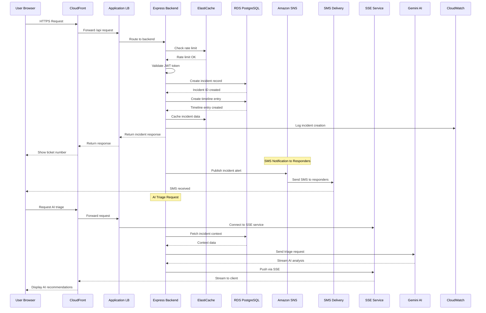

### SMS Broadcast Flow

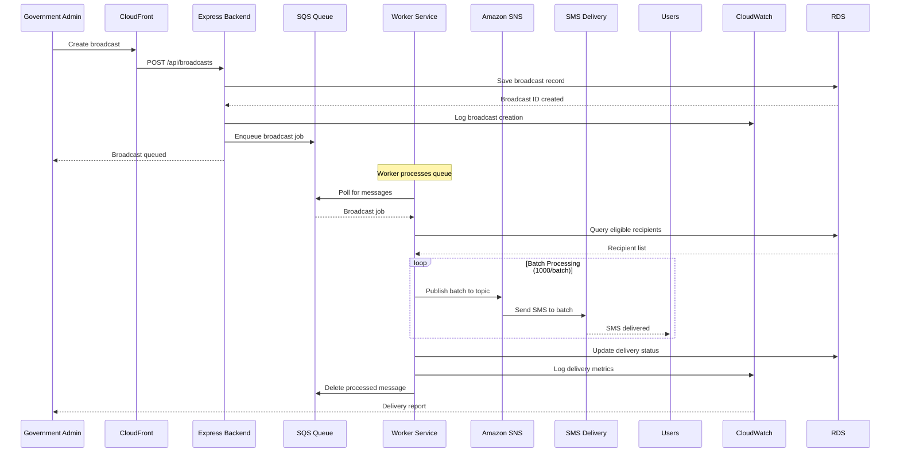

---

## Deployment Architecture

### CI/CD with AWS CodePipeline

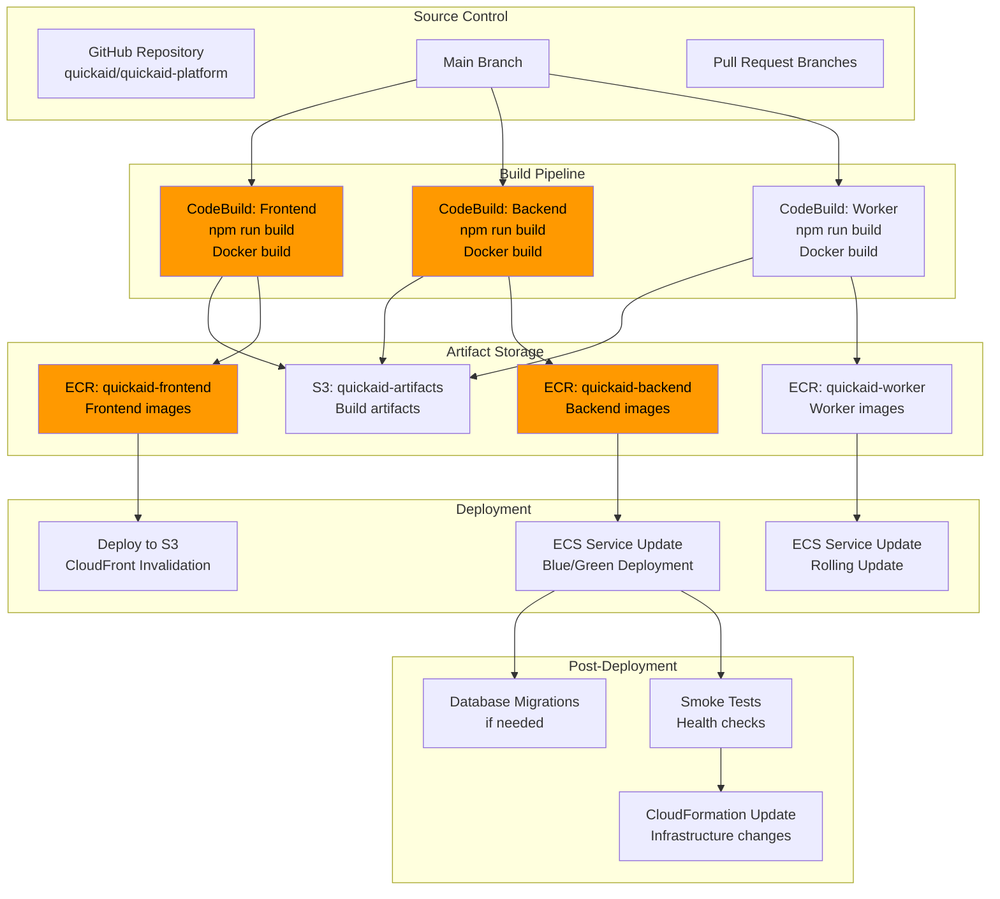

**CodePipeline Stages:**

1. **Source Stage**: GitHub webhook triggers on push to main
2. **Build Stage**: Parallel builds for frontend, backend, worker
3. **Test Stage**: Run unit and integration tests
4. **Deploy Stage**: Deploy to production with blue/green
5. **Verify Stage**: Run smoke tests and health checks

---

## Infrastructure as Code

### CloudFormation / Terraform Structure

```mermaid
graph TB
    subgraph "Infrastructure as Code"
        subgraph "Network Stack"
            VPCStack[VPC Stack<br/>Network isolation]
            Subnets[Subnets<br/>Public, Private, DB]
            Security[Security Groups<br/>NACLs, Security Groups]
        end

        subgraph "Database Stack"
            RDSStack[RDS Stack<br/>PostgreSQL cluster]
            ParameterGroups[Parameter Groups]
            SubnetGroups[DB Subnet Groups]
        end

        subgraph "Cache Stack"
            RedisStack[ElastiCache Stack<br/>Redis cluster]
            SecurityGroups[Cache Security Groups]
        end

        subgraph "Compute Stack"
            ECSCluster[ECS Cluster]
            TaskDefinitions[Task Definitions<br/>Backend, SSE, Worker]
            Services[Services<br/>Backend, SSE, Worker]
            ALBStack[Application Load Balancer]
        end

        subgraph "Storage Stack"
            S3Stack[S3 Buckets<br/>Frontend, Uploads, Logs]
            CloudFrontStack[CloudFront Distribution]
            OAC[Origin Access Control]
        end

        subgraph "Messaging Stack"
            SNSStack[SNS Topics<br/>Broadcasts, Alerts]
            SQSStack[SQS Queues<br/>SMS Queue]
        end

        subgraph "Security Stack"
            IAMStack[IAM Roles & Policies]
            SecretsStack[Secrets Manager]
            KMSStack[KMS Keys]
        end

        subgraph "Monitoring Stack"
            CloudWatchStack[CloudWatch Alarms & Dashboards]
            XRayStack[AWS X-Ray]
            ConfigStack[AWS Config Rules]
        end
    end

    VPCStack --> RDSStack
    VPCStack --> RedisStack
    VPCStack --> ComputeStack

    IAMStack --> ComputeStack
    IAMStack --> DatabaseStack
    IAMStack --> MessagingStack

    ComputeStack --> ALBStack
    ComputeStack --> SNSStack
    ComputeStack --> SQSStack

    StorageStack --> CloudFrontStack

    style VPCStack fill:#FF9900,color:#000
    style RDSStack fill:#FF9900,color:#000
    style ComputeStack fill:#FF9900,color:#000
```

---

## Cost Estimation (Monthly)

| Service | Configuration | Estimated Cost (USD) |
|---------|-------------|---------------------|
| **Compute** | | |
| ECS Fargate (Backend) | 2 tasks × 1024 CPU, 2GB RAM × 730 hours | $146.00 |
| ECS Fargate (SSE) | 2 tasks × 512 CPU, 1GB RAM × 730 hours | $73.00 |
| ECS Fargate (Worker) | 2 tasks × 256 CPU, 512MB RAM × 730 hours | $36.50 |
| ALB | 1 ALB, 2 AZs, LCU hours | $35.00 |
| **Database** | | |
| RDS PostgreSQL | db.r6g.large, 100GB GP3, Multi-AZ | $350.00 |
| ElastiCache Redis | cache.r6g.large, Multi-AZ | $210.00 |
| **Storage** | | |
| S3 (Frontend) | 10GB storage, 1TB transfer | $2.50 |
| S3 (Uploads) | 100GB storage, 500GB transfer | $25.00 |
| CloudFront | 2TB transfer, requests | $240.00 |
| **Messaging** | | |
| SNS SMS | 50,000 SMS/month | $1,500.00* |
| SQS | 100K requests | $0.40 |
| **Monitoring** | | |
| CloudWatch Logs | 50GB ingestion | $150.00 |
| CloudWatch Metrics | Custom metrics | $20.00 |
| **Other** | | |
| Route 53 | 1 hosted zone | $0.50 |
| ACM | 1 certificate | Free |
| KMS | 1 CMK | $1.00 |
| Secrets Manager | 10 secrets | $0.40 |
| Data Transfer | Inter-AZ, public | $50.00 |
| **Total** | | **~$2,840.30** |

*\*SMS cost is variable based on volume. 50,000 SMS = $0.03 per SMS in Singapore.*

---

## Disaster Recovery & High Availability

### Backup & Recovery Strategy

```mermaid
graph TB
    subgraph "High Availability Design"
        MultiAZ[Multi-AZ Deployment<br/>RDS, Redis, ECS]
        AutoScaling[Auto Scaling<br/>Based on metrics]
        HealthChecks[Health Checks<br/>Automatic replacement]
    end

    subgraph "Backup Strategy"
        RDSBackups[RDS Automated Backups<br/>7-day retention]
        RDSFinal[RDS Manual Snapshots<br/>Before deployments]
        S3Versioning[S3 Versioning<br/>Object recovery]
        ECRImages[ECR Image Tags<br/>Rollback capability]
    end

    subgraph "Disaster Recovery"
        DRPlan[Disaster Recovery Plan<br/>Documented procedures]
        RTO[Recovery Time Objective<br/>1 hour]
        RPO[Recovery Point Objective<br/>5 minutes]
        Failover[Automated Failover<br/>Multi-AZ]
    end

    subgraph "Incident Response"
        CloudTrail[Audit Trail<br/>API logging]
        GuardDuty[Threat Detection<br/>24/7 monitoring]
    end

    MultiAZ --> HealthChecks
    AutoScaling --> HealthChecks

    RDSBackups --> RDSFinal
    S3Versioning --> ECRImages

    Failover --> RTO
    RTO --> RPO

    CloudTrail --> GuardDuty
```

---

## Comparison: AWS vs Current Architecture

| Aspect | Current (Vercel+Render+Neon) | AWS Native |
|--------|------------------------------|------------|
| **Hosting** | Multiple providers | Single provider, unified management |
| **Frontend** | Vercel Edge Network | CloudFront (400+ PoPs) |
| **Backend** | Render (fixed instances) | ECS Fargate (auto-scaling) |
| **Database** | Neon (serverless PostgreSQL) | RDS (managed, Multi-AZ) |
| **Caching** | None | ElastiCache Redis |
| **SMS** | Not implemented | SNS (native, cost-effective) |
| **Monitoring** | Basic | CloudWatch (comprehensive) |
| **Security** | Basic | WAF, Shield, IAM, KMS |
| **Cost Control** | Limited | Budgets, cost allocation tags |
| **Support** | Community | AWS Support (Business+) |
| **Compliance** | SOC 2 Type 2 | Multiple certifications |

**Advantages of AWS Native:**

1. **Single Platform**: All services under one AWS account for unified billing and management
2. **SMS Integration**: Native SNS service for cost-effective SMS broadcasting
3. **Better Control**: Full control over infrastructure configuration
4. **Security**: Enterprise-grade security with WAF, Shield, and IAM
5. **High Availability**: Multi-AZ deployment for critical components
6. **Scalability**: Auto-scaling based on real-time metrics
7. **Compliance**: Multiple certifications (ISO 27001, SOC 2, HIPAA)
8. **Support**: 24/7 enterprise support with AWS Business+

**Considerations:**

1. **Complexity**: More complex setup, requires DevOps knowledge
2. **Initial Cost**: Higher initial setup, better cost at scale
3. **Learning Curve**: AWS services require learning
4. **Migration Effort**: Significant effort to migrate existing infrastructure

---

## Implementation Roadmap

### Phase 1: Foundation (Week 1-2)
- [ ] Set up AWS account and organizational structure
- [ ] Create VPC, subnets, and security groups
- [ ] Set up IAM roles and policies
- [ ] Configure Route 53 and acquire SSL certificates

### Phase 2: Storage Layer (Week 3)
- [ ] Deploy RDS PostgreSQL cluster
- [ ] Set up database migration scripts
- [ ] Deploy ElastiCache Redis cluster
- [ ] Create S3 buckets for uploads and logs

### Phase 3: Compute Layer (Week 4)
- [ ] Set up ECR repositories
- [ ] Dockerize backend services
- [ ] Deploy ECS cluster and services
- [ ] Configure Application Load Balancer

### Phase 4: Frontend Deployment (Week 5)
- [ ] Build and deploy frontend to S3
- [ ] Configure CloudFront distribution
- [ ] Set up WAF rules
- [ ] Configure cache policies

### Phase 5: SMS Integration (Week 6)
- [ ] Set up SNS topics and subscriptions
- [ ] Implement SMS service in backend
- [ ] Configure SQS for queuing
- [ ] Deploy worker service

### Phase 6: Monitoring & Security (Week 7)
- [ ] Configure CloudWatch alarms and dashboards
- [ ] Set up CloudTrail and Config
- [ ] Enable GuardDuty
- [ ] Configure Secrets Manager

### Phase 7: CI/CD (Week 8)
- [ ] Set up CodePipeline
- [ ] Configure CodeBuild projects
- [ ] Implement automated testing
- [ ] Configure blue/green deployments

### Phase 8: Testing & Launch (Week 9-10)
- [ ] Load testing and performance optimization
- [ ] Security audit and penetration testing
- [ ] Disaster recovery testing
- [ ] Production cutover

---

## Summary

This AWS-native architecture provides a comprehensive, scalable, and secure infrastructure for the QuickAid emergency response platform. Key benefits include:

1. **Unified Infrastructure**: All components under AWS for streamlined management
2. **SMS Broadcasting**: Native SNS integration for emergency alerts
3. **High Availability**: Multi-AZ deployment with automatic failover
4. **Enterprise Security**: WAF, Shield, encryption, and comprehensive IAM
5. **Auto-Scaling**: Resources scale automatically based on demand
6. **Monitoring**: Comprehensive observability with CloudWatch and X-Ray
7. **Cost Control**: Detailed cost tracking and optimization tools

The architecture supports all existing features while adding SMS notifications and providing enterprise-grade reliability and security required for an emergency response system.